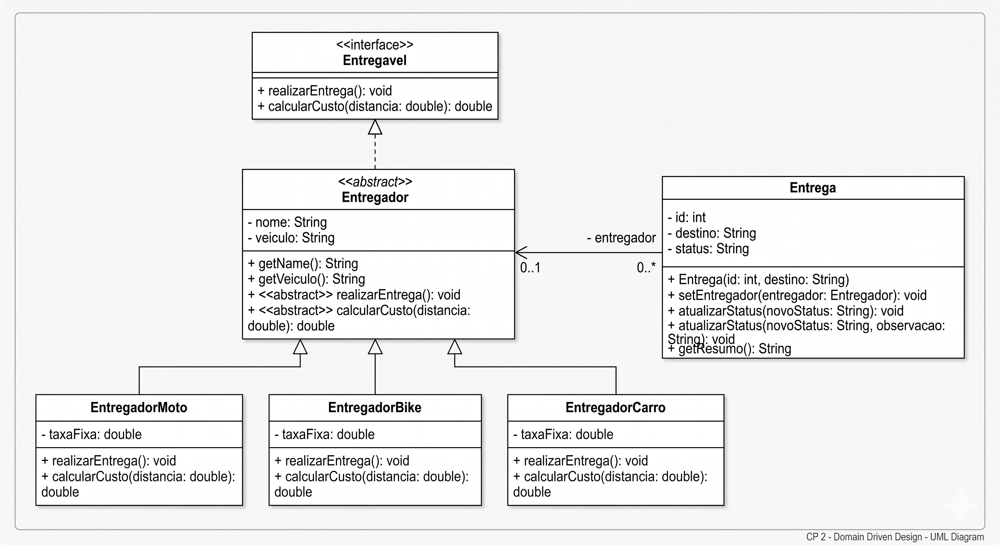

# Sistema de Logística para Entregas (E-commerce) - CP 2

## 📝 Explicação do Sistema

Este sistema simula uma operação logística de e-commerce, permitindo o gerenciamento completo de entregas e entregadores. Através de um menu interativo via console, o usuário pode cadastrar entregadores com diferentes perfis (Moto, Bicicleta, Carro), criar novos pedidos, atribuir entregas a profissionais disponíveis e atualizar o status de cada envio em tempo real.

## 🛠️ Decisões de Modelagem (POO)

O projeto foi desenvolvido focando na correta aplicação dos pilares da Programação Orientada a Objetos para garantir que o sistema possa crescer de forma sustentável:

*
**Herança e Abstração**: A classe `Entregador` foi definida como **abstrata**, pois não deve existir um entregador "genérico" no sistema; ele deve obrigatoriamente ser de um tipo específico como Moto ou Bicicleta.


*
**Interfaces**: A interface `Entregavel` estabelece o contrato de comportamento para o domínio, garantindo que qualquer tipo de transporte implemente obrigatoriamente as funções de realizar a entrega e calcular o custo.


*
**Polimorfismo (Sobrescrita)**: O método `calcularCusto` é sobrescrito em cada subclasse para aplicar taxas diferentes (ex: motos possuem custos por km diferentes de bicicletas).


*
**Polimorfismo (Sobrecarga)**: Na classe `Entrega`, o método `atualizarStatus` foi sobrecarregado para permitir tanto uma atualização rápida (apenas o status) quanto uma atualização detalhada (status + observação do ocorrido).


*
**Encapsulamento**: Todos os atributos das entidades são privados, com acesso restrito via métodos públicos (Getters e Setters), protegendo a integridade dos dados do sistema.


## 📊 Diagrama de Classes UML

O diagrama abaixo representa a estrutura de classes, as relações de herança e a implementação da interface desenvolvida para este projeto.


## 🚀 Como Executar o Projeto

O sistema é executável via terminal através da classe `Main`.

1. Clone o repositório para sua máquina local.
2. Navegue até o diretório `src`.
3. Compile os arquivos Java:
```bash
javac *.java

```


4. Execute o programa:
```bash
java Main

```


5. Siga as instruções do menu interativo para simular as operações logísticas.


---

## 👥 Integrantes do Grupo (2ESPY)

* **Arthur Berlofa Bosi** - RM: 564438
* **Danilo Fernandes** - RM: 561657
* **Davi Falcão** - RM: 561818
* **Mateus Saavedra** - RM: 563266
* **Ulisses Ribeiro** - RM: 562230

---

**Data de Entrega**: 10/05/2026 **Disciplina**: Domain Driven Design **Professora**: Damiana Costa